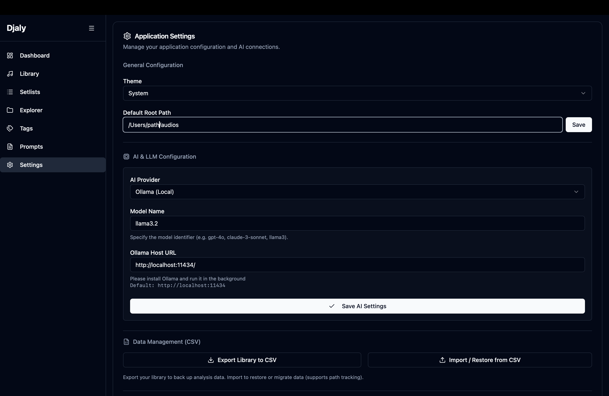
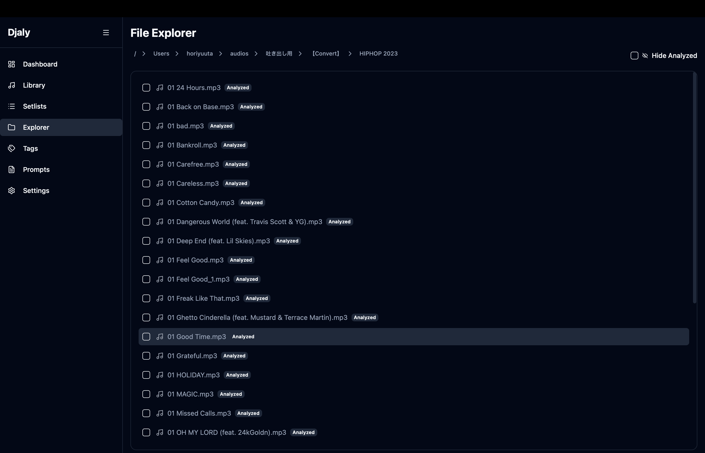
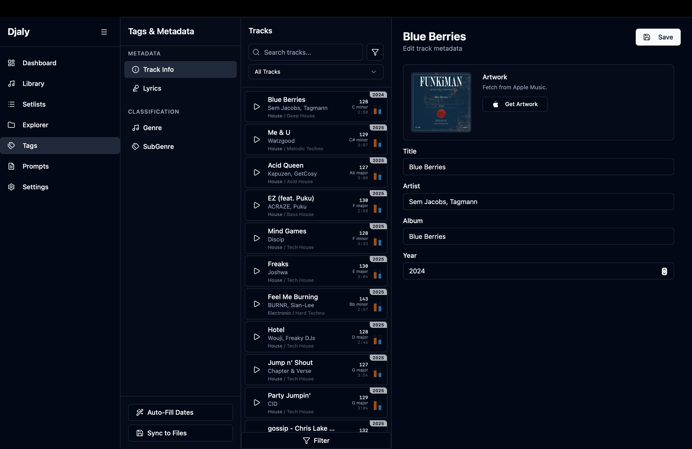
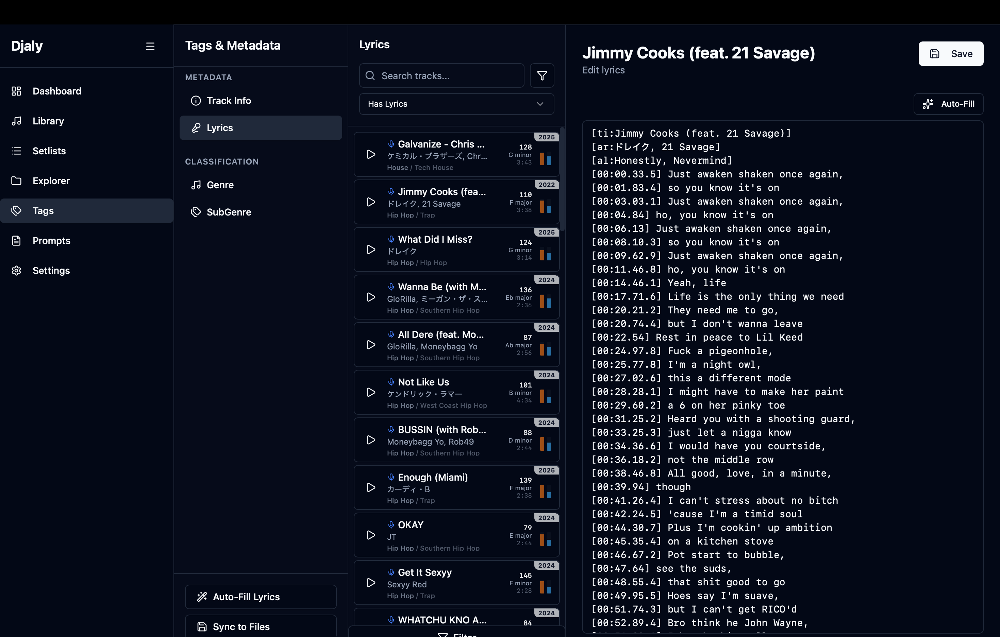
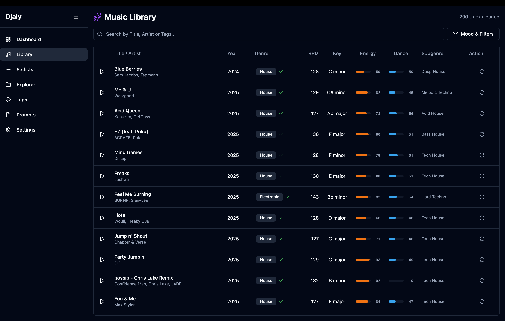
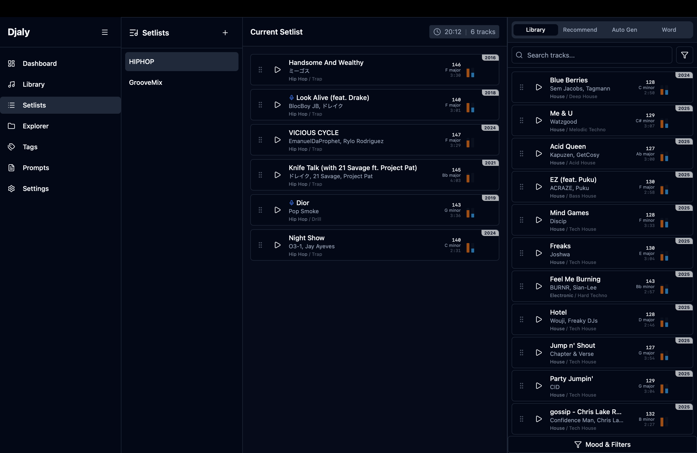
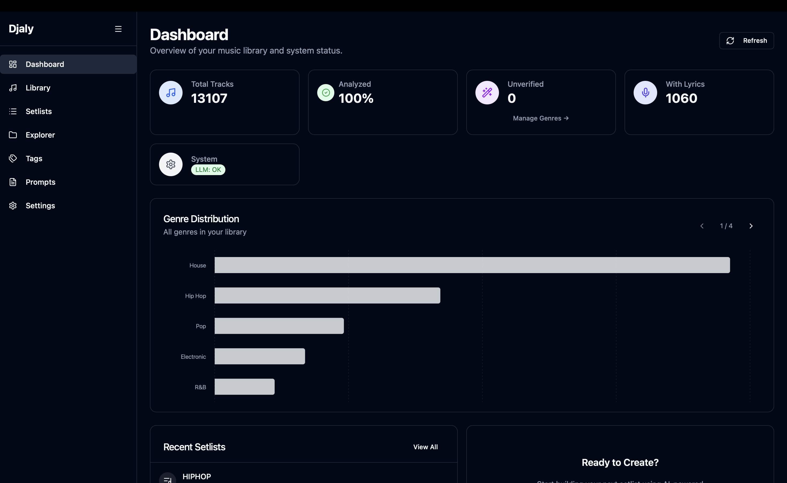
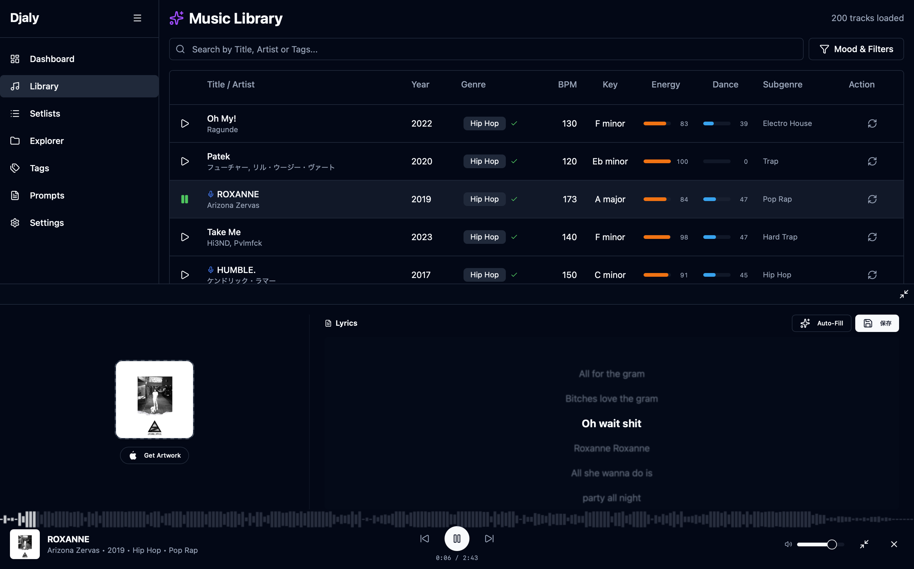

# Djaly

Djalyは、ローカルファーストの音楽ライブラリ管理およびDJツールです。AIを活用した高度な楽曲解析・管理機能を提供します。

## 主な機能

- **高度な楽曲解析**: 楽曲の音声特徴量を詳細に解析・抽出します。
- **AIジャンル推定**: AI (Ollama/Gemini) を活用したジャンル分類と表記揺れの統一。
- **Vibe検索**: 自然言語や楽曲の特徴量に基づいた「雰囲気」での楽曲検索。
- **セットリスト作成支援**: 類似楽曲の提案や、AIによるセットリスト自動生成。
- **Rekordbox連携**: 作成したセットリストをM3U8形式でエクスポート可能。

## インストール方法

### 1. アプリのダウンロード
[Releasesページ](https://github.com/Yutahhhhh/Djaly/releases) から、お使いのOSに合わせたインストーラーをダウンロードしてください。

- **macOS**: `.dmg` ファイル (Apple Silicon用: `aarch64`, Intel用: `x86_64`)
- **Windows**: `.exe` または `.msi` ファイル

### 2. アプリの起動
ダウンロードしたインストーラーを実行し、アプリをインストール・起動してください。

#### ⚠️ macOSをお使いの方へ（重要）
現在、アプリへの署名（Appleによる公証）を行っていないため、インストール後に**「"Djaly"は壊れているため開けません」**というエラーが表示される場合があります。
その場合は、以下の手順で起動してください。

1. アプリを `Applications` （アプリケーション）フォルダに移動します。
2. `ターミナル.app` を開きます（Launchpad > その他 > ターミナル）。
3. 以下のコマンドをコピー＆ペーストして実行（Enterキー）してください。
   ```bash
   xattr -cr /Applications/Djaly.app
   ```
4. 再度アプリをクリックして起動してください。

## 使い方 (User Guide)

### 1. 初期設定 (Settings)

アプリを起動したら、まずは `Settings` 画面で以下の設定を行います。

- **Music Directory**: 楽曲ファイルが保存されているルートディレクトリを指定します。
- **LLM Settings**:
  - **Ollama**: ローカルでLLMを動かす場合に使用します（プライバシー重視）。
  - **Google (Gemini)**: **推奨**。ジャンル解析などの精度が高く、処理も高速です。APIキーの設定が必要です。
- **Data Management**:
  - **Library Data**: ライブラリ全体のバックアップや復元（インポート/エクスポート）が可能です。
  - **Metadata**: 楽曲のメタデータのみをJSON形式でエクスポート/インポートできます。
  - **Presets**: 検索条件やプロンプト設定などのプリセット情報を管理できます。

### 2. 楽曲の取り込み (File Explorer)

`File Explorer` 画面から楽曲の解析を開始します。

- 指定したディレクトリ内の楽曲をスキャンし、データベースに取り込みます。
- **バックグラウンド処理**: 数千曲単位の解析もバックグラウンドで実行されます。
- **変更検知**: ファイルパスが変更された場合や新しいファイルが追加された場合、再解析を行うことで検知・更新されます。

### 3. タグ管理 (Tag Manager)
楽曲のメタデータやジャンル情報を包括的に管理します。

#### メタデータ・ジャンル編集


- **Track Info**: リリース年などの基本情報を編集。「Auto-Fill Dates」機能でWebから情報を自動取得・補完可能。
- **Classification (Genre / Subgenre)**:
  - **ジャンル解析**: 楽曲の特徴量やメタデータを元にジャンルを判定。
  - **表記揺れの統一**: "Hip-Hop", "Hip Hop" などの表記揺れをAIが自動統一。
  - **類似楽曲判定**: 解析済みの特徴量から類似楽曲を見つけ、ジャンルを推測・補完。
- **Sync to Files**: データベース上の変更（ジャンル、歌詞、メタデータ）を、実際の楽曲ファイル（ID3タグ等）に一括書き込み。

#### 歌詞管理


- **Lyrics**: 歌詞情報の管理。「Auto-Fill Lyrics」機能での自動取得、手動編集に対応。

### 4. ライブラリ管理 (Music Library)

取り込んだ楽曲は `Music Library` で確認・検索できます。

- **Vibe検索**: "Chillな夕暮れ" のような抽象的な言葉で楽曲を検索できます。
- **範囲検索**: BPMやKey、Energyなどの特徴量パラメータを範囲指定して検索可能です。
- **ジャンル検索**: 整理されたジャンルタグでフィルタリングできます。

### 5. セットリスト作成 (Setlist Creator)

DJプレイのためのセットリストを作成します。

- **ライブラリから追加**: 検索結果からドラッグ＆ドロップで追加。
- **類似楽曲提案**: 選択した楽曲に似ている曲をAIが提案します。
- **Auto Generation**: 開始曲と終了曲（オプション）を指定すると、その間を繋ぐセットリストを自動生成します。
- **エクスポート**: 完成したセットリストは **Rekordbox** 等で読み込めるプレイリスト形式（.m3u8）でエクスポート可能です。

### 6. プロンプト管理 (Prompt Manager)

Vibe検索やセットリスト自動生成で使用されるAIプロンプトをカスタマイズできます。自分好みの検索ロジックや生成ルールを追加・編集可能です。

### 7. ダッシュボード (Dashboard)

現在の楽曲解析状況（進捗率）、ライブラリの統計情報などを確認できます。

### 8. ミュージックプレイヤー (Music Player)


再生中の楽曲のアートワークや歌詞を表示・編集できる高機能プレイヤーです。

- **波形表示 (Waveform)**: 楽曲の波形を可視化し、視覚的に再生位置を確認できます。
- **アートワーク管理**:
  - **Web取得**: 楽曲情報を元にWebからアートワークを検索・取得できます。
- **歌詞管理 (Lyrics)**:
  - **同期歌詞表示**: LRC形式の同期歌詞表示に対応しており、カラオケのように再生に合わせて歌詞が流れます。
  - **編集・保存**: その場で歌詞を修正・保存できます。Webからの歌詞取得もサポートしています。
