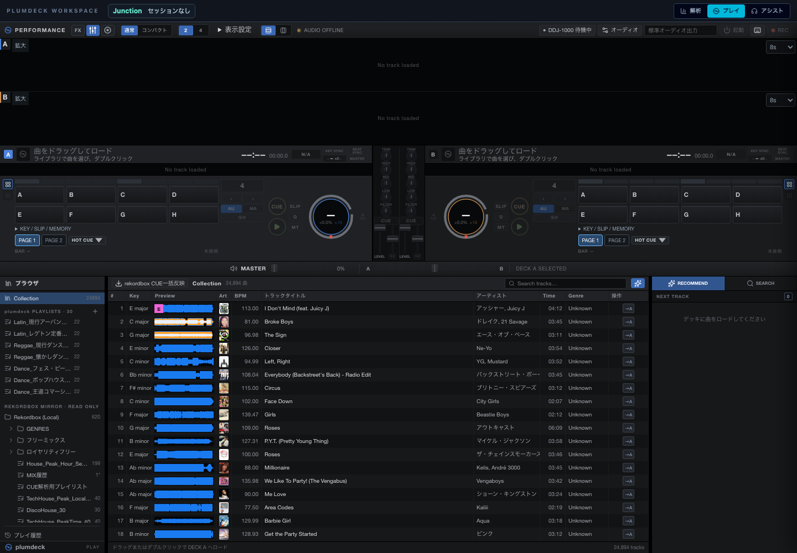

# plumdeck

ローカルの音楽ライブラリを整理し、選曲・DJプレイ・rekordboxの選曲補助に使うデスクトップアプリです。Tauri / React、FastAPI / DuckDB、Essentia / MusiCNN、Mixxx音声エンジンで構成しています。

plumdeck自身はLLMを呼び出しません。自然言語の解釈やジャンル分類の判断は、接続したMCPクライアントが行います。

## 操作ガイド

アプリの「解析」モードで、サイドバーの **Docs** を開いてください。機能別の日本語ガイド、説明用データによる画面キャプチャ、検索、画像の拡大表示を用意しています。

| 画面 | 主な用途 |
| --- | --- |
| Dashboard / Explorer | ライブラリの状況確認、音源の取り込み・解析 |
| Library / Tags | 曲の検索・試聴、曲情報・歌詞・ジャンルの編集 |
| Setlists / Wordplay | 曲順の作成、候補の確認、M3U8書き出し |
| プレイ | 2・4デッキ、波形、EQ、CUE、ループ、FX、サンプラー、録音 |
| アシスト | rekordboxのデッキを基準に次曲を探し、元音源をドラッグ |
| Junction（JCT） | リモートDJの参加承認、演奏状態の引き継ぎ、ホストからの配信 |
| Workflow Tools | 音源修復、版管理、完全バックアップ、機器・USB・録音・Play取り込み |
| Settings / MCP | 音楽フォルダ、録音、CSV入出力、外部MCPクライアント接続 |



CSVとM3U8には音源ファイル自体は含まれません。音源の移動・バックアップは別に行います。Tagsのファイル反映は元の音源タグを更新します。

## Library Workflow Tools

解析モードの **Workflow Tools** には、ライブラリを壊さずに日常運用するための機能をまとめています。

- 音源参照は診断プレビュー後に更新し、track ID、解析結果、CUE、履歴を維持します。保存済みSHA-256と一致しない候補は自動確定しません。
- Original / Clean / Intro / Extendedなどの版をグループ化できます。セット内の同じ曲が複数回登場しても、指定したentryだけを差し替えます。
- セットのIN、OUT、一定の再生速度、追加時間、次曲との重なりから予定尺を計算します。並べ替えて隣接関係が変わった重なりは0へ戻ります。
- 完全バックアップはDuckDB、解析ジョブ、許可されたUI設定をmanifestとSHA-256付きで保存し、必要なら音源と録音も含めます。復元は検査、確認、staging移行、DBと解析ジョブのrollback保存を経て行います。復元中に終了した場合は次回起動時に両DBを復元前へ戻します。音源を含めなかったバックアップから音源本体は復元できません。TURN資格情報、キーチェーン、再生中の状態は含めません。
- 音声ルーティングは名前付きプリセットとして保存できます。読み込んだだけでは出力を変更せず、Playのオーディオ画面で接続機器のMaster/CUEチャンネルを選び、適用して確認します。現在は同一機器内の連続2チャンネル、44,100 Hz / 256 framesに対応します。
- DDJ-400の内蔵マッピングと、選択したMIDI機器から1操作ずつ取得するMIDI Learnに対応します。DDJ-1000固有の高速入力・表示フィードバックは他機器へ送りません。DDJ-400と汎用MIDIのLEDフィードバックは未対応です。
- USB一覧と安全な取り外しはmacOS／Windowsに対応します。WindowsではUSB接続のSSDも認識し、ドライブ文字が変わってもボリュームIDで識別します。USBはセットの固定snapshotとrekordbox XMLを作ります。rekordboxでXMLを取り込み、対象USBへExportしてから確認記録を残します。plumdeckはPioneerのUSBデータベースを直接生成・変更しません。実機確認は型番、firmware、日時、確認項目を伴う別の証拠です。
- 録音の長さはレコーダーの実フレーム数を使用します。曲目の区間は約20ms間隔のエンジン観測による推定で、細かなカットの完全な記録は保証しません。録音一覧からRange対応で試聴でき、外部録音はファイルから長さを検証して登録できます。
- Play画面へFinderから音源／フォルダをドロップできます。Collectionまたはドロップ時点のローカルプレイリストを追加先として固定し、元ファイルへタグを書きません。Rekordbox Mirror、履歴、録音へのドロップは拒否します。

USBのXML取り込み、CDJ/XDJ、任意のMIDI機器、各音声出力は環境依存です。自動テスト済みの状態と、rekordbox／実機で確認済みの状態は画面と検証記録で区別してください。

## 配布版の環境とMCP設定

Plumdeck本体のMCPは、起動中のアプリへHTTPで接続します。Python、ソースコード、開発者のホームディレクトリは不要です。接続先はアプリのMCP画面で確認してください。配布版の既定は `http://127.0.0.1:48123/mcp`、開発時は `http://127.0.0.1:8001/mcp` です。リポジトリの `.mcp.json` と `opencode.json` は配布版の接続例です。

rekordboxのDBを直接操作する `rekordbox-mcp` は別の任意ツールです。Plumdeck本体の利用に必須ではありません。必要な場合だけ、[導入手順](rekordbox-mcp/README.md)に従ってインストールし、クライアント側で登録してください。PATHで実行できる環境の設定例は次の通りです。

```json
{
  "mcpServers": {
    "rekordbox": {
      "type": "stdio",
      "command": "rekordbox-mcp",
      "args": ["--mode", "readonly"]
    }
  }
}
```

DBは実行ユーザーのmacOS／Windows標準保存先から自動検出します。独自の場所へ移している場合のみ `REKORDBOX_DB_PATH` を指定してください。GUIから起動したMCPクライアントのPATHにコマンドがない場合は、その利用者のインストール先をクライアントのローカル設定に指定します。個人パスを共有設定へコミットする必要はありません。

アプリのDBとログは `platformdirs` によるユーザー専用データディレクトリに保存します。`USER_DATA_DIR`、`DB_PATH` による明示指定は引き続き使用できます。音楽フォルダーの既定もOSのユーザーフォルダーです。録音変換と詳細波形は同梱FFmpegを使い、Windowsでは `ffmpeg.exe` を解決します。配布物が壊れている場合、開発機のツールへ暗黙に切り替えません。

起動時にポートが競合しても、別アプリのプロセスを終了しません。競合するアプリを確認して終了してから再起動してください。Plumdeck自身が起動したバックエンドはアプリ終了時に停止します。

WindowsではFFmpeg・librosa・TensorFlow CPUでBPM／キー／音色／波形／MusiCNN埋め込みを解析します。macOSはEssentiaを使用します。MusiCNNのモデルと入力スペクトル仕様は共通です。BPM・キーの推定アルゴリズムにはOS差があるため、解析履歴には使用したコンポーネントのバージョンを記録します。

Release workflowは両OSでネイティブ音声エンジンをビルドし、必要なDLL／Frameworkとバックエンドを同梱します。Windows distribution validationでは、通常のPATHを外して同梱exeから解析し、API・MCPの起動とインストーラーの生成を検証します。音声デバイス、DDJ本体、rekordboxのUIとの実機検証はこのCIとは別です。

## ローカル開発

フロントエンドはNode / pnpm、デスクトップはRust / Tauri、バックエンドはPython環境を使います。ネイティブ音声エンジンのビルド対象はmacOS / Apple SiliconとWindows x64です。ブラウザだけでは音声エンジン、MIDI、rekordboxデッキ取得、外部アプリへのドラッグは利用できません。

```bash
pnpm install
pnpm backend:install
pnpm tauri
```

個別に起動する場合は `pnpm backend:dev` と `pnpm dev` を使います。開発時のバックエンドは通常 `127.0.0.1:8001`、フロントエンドは `127.0.0.1:1420` です。APIの参照先は `src/services/api-client.ts` と環境変数に集約しています。

```bash
pnpm build
pnpm test:backend
node --experimental-strip-types --test native/dj-engine-host/tests-node/*.test.ts
cargo test --manifest-path src-tauri/Cargo.toml --lib --locked
```

音源・DB・モデル・ビルド成果物・認証情報はGitへ含めません。永続的な操作説明と開発上の前提はREADME、アプリの使い方はDocsへ置きます。一時的な調査報告、設計メモ、検証出力、サンプルのM3U8やキャプチャはリポジトリ外に保存します。実行可能な回帰テストと、そのテストが必要とするフィクスチャは保持します。

## Mixxx音声ホスト

`native/mixxx-engine-host` が音声エンジンです。固定したMixxxのソースへアダプターを組み込みます。依存ソースの変更はビルド時に生成するヘッダー等へ限定し、取得した上流チェックアウトを直接編集しません。

```bash
pnpm dj-engine:build
pnpm dj-engine:stage
pnpm tauri:build:performance
```

WindowsではVisual Studioの「x64 Native Tools Command Prompt」でビルドします。Python 3.11、Git、Node 24、Rust、CMake、Ninjaが必要です（`python -m pip install cmake ninja`）。依存ソースとWindowsライブラリは固定リビジョン／ハッシュから取得し、DLL・Qtプラグイン・リソースをステージへまとめます。Windows利用者側にVisual Studio、Python、WSL、Homebrewは不要です。

Apple Siliconでは `/opt/homebrew` のARM64ツールチェーンを使用します。依存バージョンは `native/mixxx-engine-host/dependency-versions.json`、固定リビジョンと取得処理はビルドスクリプトにあります。Mixxxホストを含む配布では、同梱ライブラリ・署名・対応ソースの確認も必要です。

```bash
bash native/mixxx-engine-host/scripts/package-corresponding-source.sh
```

このスクリプトは固定されたMixxx、GSL、libdatachannelとサブモジュール、Opus、libnice、SoundTouch、RubberBand、libsamplerateのソースとplumdeck側のアダプター・ビルド手順をまとめます。実行には依存ソースの取得とネットワーク接続が必要です。

### DDJ-1000・音声出力

プレイ画面の「オーディオ」で出力を選択します。DDJ-1000はMASTERにUSB 1/2、ヘッドホンCUEにUSB 3/4を使います。本体のUSB A/B切替を接続先に合わせてください。MIDIの接続・ジョグ移動量・再接続はプレイ画面上部のDDJ-1000設定から行います。

出力デバイスの変更では再生・録音を停止してデッキを解除します。マイクはMasterと録音へ入り、ダッキングはDJ音を下げます。録音の保存形式・保存先はSettingsで変更します。

MIDIアドレスの照合データは `native/dj-engine-host/tests-node/fixtures/ddj1000-midi-map.json` に置いています。ジョグ表示の実装は `src-tauri/src/dj_engine/jog_display.rs` です。MIDI/HIDの送信数だけで実機の点灯や表示を確認したことにはしません。

## Junction（JCT）

JCTはホストとプレイ担当者を分けます。音声はWebRTC / Opusで送り、ホストの独立したProgram出力から遅延付きで配信します。ヘッドホンCUE・プライベート試聴はProgramへ混ぜません。共有デッキは現在のプレイ担当者が操作し、交代前の操作権を持つ入力は拒否します。

引き継ぎでは音源をハッシュで照合し、4デッキ・64サンプラースロットとミキサーの状態を準備します。キー固定、遅延・変調系FX等は型付きのDSP状態も移送します。最終確認中は共有操作を制限し、音声照合を通過した場合に将来の時刻で操作権を切り替えます。

### 手動で接続する（既定）

運営の接続調整サーバー、アカウント、課金認証は不要です。ホストが「セッションを作成」し、DJごとに招待を作ります。参加DJは招待を確認して返答を作り、ホストが取り込んで「参加を許可して接続」を押します。招待・返答はコピーまたはファイルで受け渡します。コピーしただけでは送信されません。

音声・操作と楽曲転送の2つの接続について、ICE候補が揃うまで共有できません。招待は15分有効（持ち込み資格情報が先に切れる場合はその期限まで）です。返答の取り込みと承認は別操作で、接続や再交換だけでは演奏権は移動しません。パネルを閉じても演奏と接続は続きます。

既定では公開STUNを接続先の探索に使います。直接接続できない場合は、ホストが「直接つながらないときの中継設定」に自分のTURNを設定できます。「運営サーバー不要」は「外部サーバーを一切使わない」という意味ではありません。今回は運営クラウドを配備していません。

TURN RESTの共有シークレットはネイティブ内に保持し、保存を選ぶとmacOSキーチェーン、WindowsではログインユーザーのDPAPIで暗号化して保管します。招待へ渡すのは参加者ごとに発行する30分有効の接続用資格情報だけです。発行済み一時資格情報も、期限を示すTURN REST形式のユーザー名と24時間以内の期限で利用できます。期限切れの資格情報を再使用しません。設定変更・更新後は同じDJの招待を作り直して再交換します。管理用APIキーや長期秘密鍵を招待・返答へ入れません。接続テストは実際の中継候補取得を確認しますが、相手との接続や全回線での成功を保証するものではありません。

短い通信断は同じ接続の復旧を待ち、戻らなければ同じ参加者カードで新しい招待・返答を交換します。他のDJの接続と演奏権は維持します。取り消し・拒否をオフラインの相手に知らせる場合は、署名付き通知をコピーして渡します。表示名だけでは本人確認できないため、招待と返答は相手を確認できる経路で受け渡してください。

### 既存の接続サービス（開発用の別方式）

従来のサーバー方式はネイティブAPIの明示的な `exchangeMode: "server"` と接続URLで利用できます。通常UIの手動接続はこのサービスを起動せずに動作します。構成は [接続サービスのREADME](services/junction-signaling/README.md) を参照してください。

初回のローカルネットワーク接続はmacOSの案内に従って許可します。設定は「システム設定 → プライバシーとセキュリティ → ローカルネットワーク」で確認できます。開発用のad-hoc署名はmacOSで識別が安定しない場合があるため、配布時にはApple発行の署名で直接接続も確認します（[Apple TN3179](https://developer.apple.com/documentation/technotes/tn3179-understanding-local-network-privacy)）。

招待には参加情報が含まれます。ホストが参加者を承認し、必要に応じて招待を再発行します。招待・復旧シークレット・TURN共有シークレットはログやGitへ残しません。

### 検証

```bash
native/mixxx-engine-host/build-junction/junction-core-tests
native/mixxx-engine-host/build-upstream/junction-fx-tests
pnpm junction:test:manual
pnpm junction:test:integration # 既存サーバー方式の回帰試験
```

実音声の統合試験は、ビルド済みのmacOSホストとステレオのループバックデバイスを使います。既定のデバイスはBlackHole 2chです。`PLUMDECK_MIXXX_OUTPUT_DEVICE` で変更できます。実音声の試験は同じデバイスを奪い合わないよう直列で実行します。

手動方式は `pnpm junction:test:manual` で3プロセスを起動し、招待・承認・取消・引き継ぎ・再交換とProgram音声を検証します。`JUNCTION_TURN_ADDRESS=127.0.0.1:3478?transport=tcp`、`JUNCTION_TURN_SECRET_FILE`、`PLUMDECK_JUNCTION_FORCE_RELAY=1` を指定すると持ち込みTURNを検証します。テスト時は `PLUMDECK_JUNCTION_EPHEMERAL_NETWORK=1` で実際のキーチェーンに触れません。

既存サーバー方式の統合試験には次の追加条件があります。

- `PLUMDECK_JUNCTION_TEST_DECKS=4`：4デッキ。
- `PLUMDECK_JUNCTION_TEST_THIRD=1`：3人、ゲスト間の交代。
- `PLUMDECK_JUNCTION_TEST_SAMPLER=1`：表示中・非表示バンクの発音。
- `PLUMDECK_JUNCTION_TEST_MUSIC_OPERATIONS=tempo,keylock,eq,loop,next`：交代後の演奏変更。
- `PLUMDECK_JUNCTION_TEST_FX` / `PLUMDECK_JUNCTION_TEST_COLOR` / `PLUMDECK_JUNCTION_TEST_PAD`：効果名を指定。
- `PLUMDECK_TEST_HOST`：パッケージ内など別のホスト実行ファイルを指定。
- `PLUMDECK_JUNCTION_TEST_TURN_TTL=8`：短いTURN認証期限で、更新後の参加・交代を確認。
- `JUNCTION_TURN_ADDRESS` / `JUNCTION_TURN_TLS=1` / `JUNCTION_TURN_SECRET_FILE` / `PLUMDECK_JUNCTION_FORCE_RELAY=1`：用意したTURN経由で接続。

### 現在の制約

準備中の演奏変更は状態の再取得で追従します。継続的な変更がある場合は準備完了が遅れます。全操作について実際の音声適用フレームを記録・再生する操作ジャーナルは未完成です。

手動方式は短い通信断からの復帰と参加者単位の再交換に対応しています。IP変更やスリープ復帰で既存候補が使えなくなった場合は、新しい招待・返答が必要です。実際のWi-Fi／テザリング切り替えなどは別回線での確認が必要です。

同一Mac上の複数プロセス、実音声Program、TURN TCP/TLSでの試験と、別Mac・別回線・実機の検証は区別してください。2台のMac・異なるインターネット回線・DDJ実機・clusterへの実配信、8人の大容量転送、2時間の連続運用は未検証です。現時点ではこれらの条件を満たす本番運用の保証はしていません。

## rekordboxアシスト

macOSのアクセシビリティ、WindowsのUI Automationから、rekordboxが表示しているデッキの曲情報を読み取ります。macOSでは初回の案内に従ってplumdeckのアクセシビリティを許可してください。Windowsでは両アプリを同じユーザー・権限で起動し、rekordboxのPERFORMANCE画面を表示します。Windows標準のPowerShell／.NETを使う読み取り処理は、時間と出力量を制限した別プロセスで動きます。OCRや画面録画は使用しません。

「グルーヴ」「展開」「ワードプレイ」、エネルギーの方向、ジャンル条件を選んで候補を探します。現在の基準デッキは手動で選択します。ロードを確認した曲は履歴へ保存し、候補から除外します。新しいセットでは履歴をリセットできます。

確認済みの画面構成はrekordbox 7.2.18の2Deck Horizontalです。同名曲などで一意に照合できない場合は未確認として表示します。アシストへの切り替えではplumdeckの音声とコントローラー接続を解放します。

`src-tauri/vendor/drag` はdrag 2.1.1を同梱しています。macOSの外部Copyドラッグで `NSDragOperationCopy | NSDragOperationGeneric` を許可し、JUCEがGenericを返す場合に対応する変更があります。Copy操作に移動・削除は追加していません。上流のApache-2.0 / MITライセンスは同ディレクトリに保持しています。

## MCP・データ操作

アプリのMCP画面に表示されるURLでStreamable HTTPに接続します。通常の製品ビルドは `http://127.0.0.1:48123/mcp`、開発時は `http://127.0.0.1:8001/mcp` です。利用可能なツールは起動中のサーバーの一覧で確認してください。

- あいまいな選曲条件はクライアント側でBPM・Energy等の条件に変換し、検索へ渡します。
- 書き込みには検索で取得したtrack id / setlist idを使います。名前から存在を仮定しません。
- ジャンルは文脈取得後にクライアントが判断し、構造化した結果を適用します。
- 音響再解析は影響範囲を確認して開始し、既存タグを保持する設定を優先します。
- ワードプレイは歌詞を読んで提案し、承認と実際の試聴確認を区別します。
- セットリスト、分類、解析ジョブはUIと共有する永続状態です。同じ対象へ複数の処理が並行して書き込まないようにします。

rekordbox MCPの起動・DBモード・操作手順は [rekordbox-mcp/README.md](rekordbox-mcp/README.md) にあります。plumdeckに同梱した接続設定は読み取り専用です。

## ブランチ・配布

`main` を配布の基点とし、変更は `feature/*`、`fix/*`、`refactor/*`、`chore/*` で進めます。ブランチのプッシュと製品リリースは別の操作です。

`pnpm package` はこのOSのバックエンド・ネイティブ音声エンジン・Tauriインストーラーをローカルで作成します。公開操作は行いません。タグをGitHubへプッシュするとRelease workflowが両OSの配布物を作成します。`pnpm release vX.Y.Z` は既にプッシュしたタグのRelease workflowをGitHub CLIで再実行します。通常の開発確認では実行しません。配布物は [Releases](https://github.com/Yutahhhhh/plumdeck/releases) で確認してください。対応OS・アーキテクチャ・署名状況は実際に配布されたファイルに従います。

## ライセンスと対応ソース

Mixxx音声ホストはMixxx 2.5.6のコミット `3ebac449e7e5fe2a0186596657696e87ce8b0e56` を利用し、GPL-2.0-or-laterの条件で配布します。plumdeckのアダプターとビルドスクリプトも対応ソースの一部です。プロセスを分けることをライセンス適用の免除とは扱いません。

JCTではSoundTouch 2.4.1、RubberBand 4.0.0、libdatachannel、libnice、Opus等を使用します。SoundTouchとRubberBandの状態移送用ビルドには上流のライセンス条件が適用されます。固定ソース・ビルド構成・変更用スクリプトは対応ソースのアーカイブへ含めます。Qtなど動的リンクのライブラリについては、互換ビルドへの置き換えを妨げない構成を維持します。

同梱物のライセンスはステージ済みホストの `Contents/Resources/licenses` に置きます。対応ソースのアーカイブには固定依存ソース、アダプター、ビルド環境・Homebrewメタデータ・同梱ファイルの一覧を含めます。

- [Mixxxのライセンス](https://github.com/mixxxdj/mixxx/blob/2.5.6/LICENSE)
- [Mixxxのソース](https://github.com/mixxxdj/mixxx/tree/2.5.6)

RustのシミュレーターはMixxxコードを含まず、依存バージョンは `native/dj-engine-host/Cargo.lock` で固定しています。
