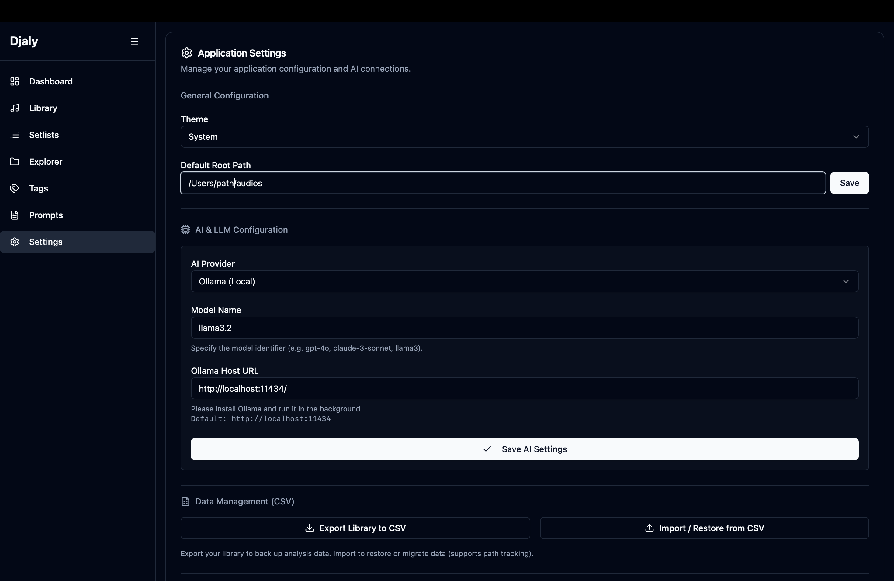
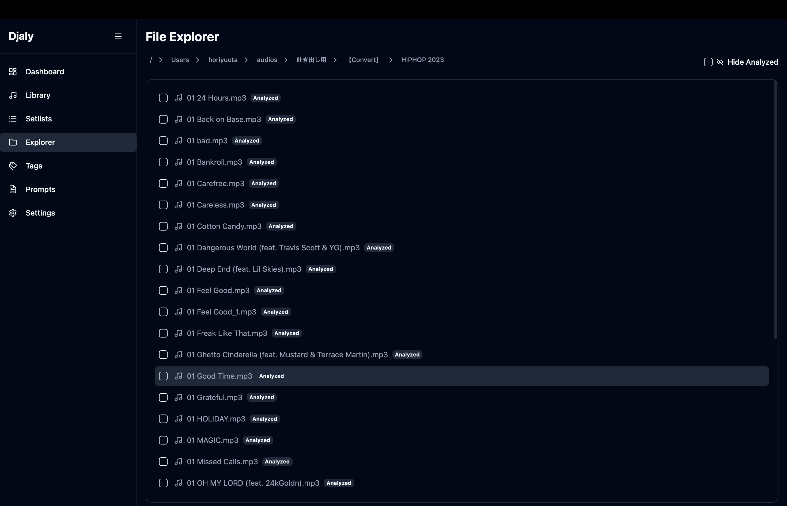
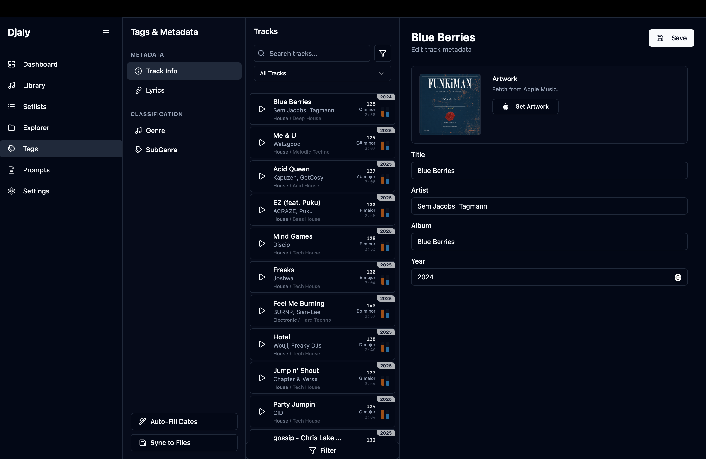
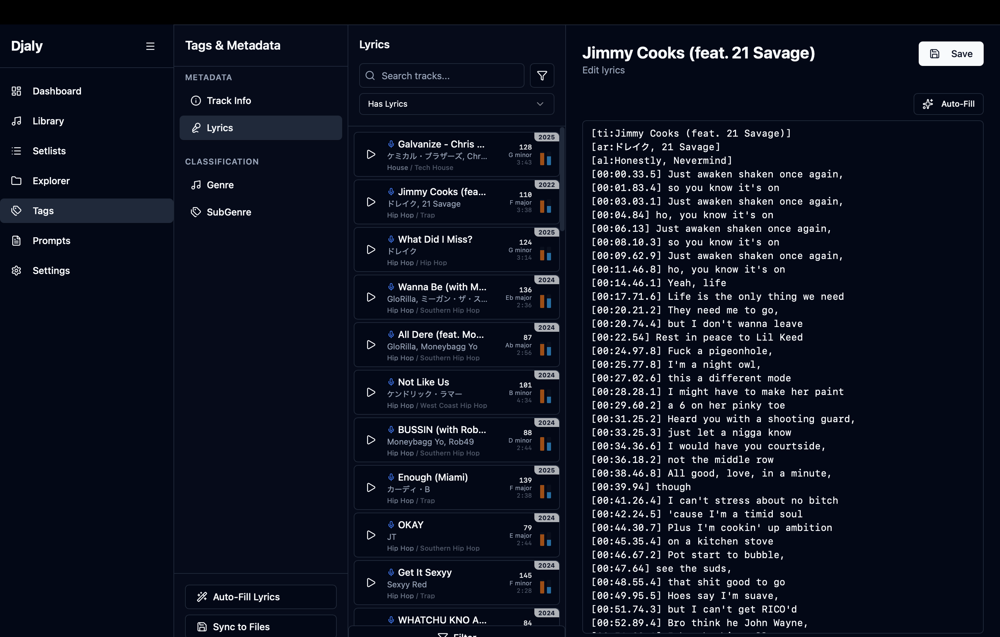
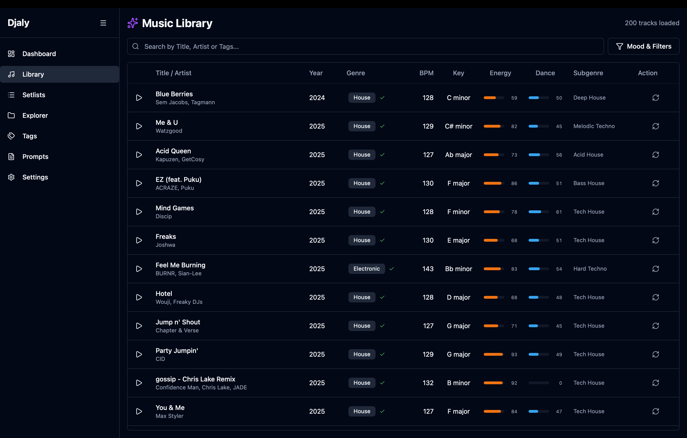
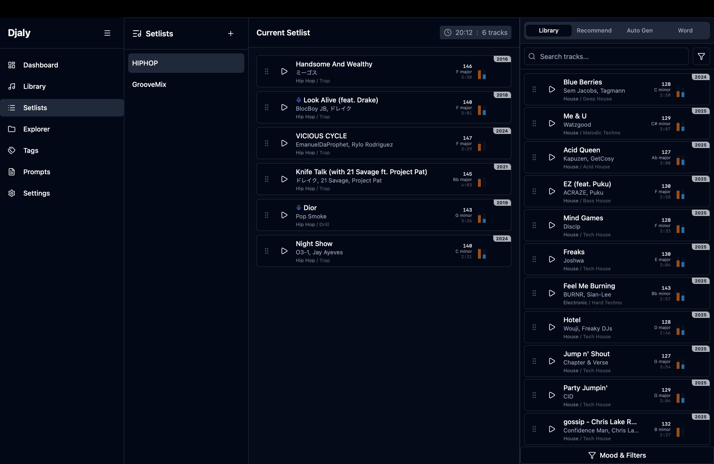
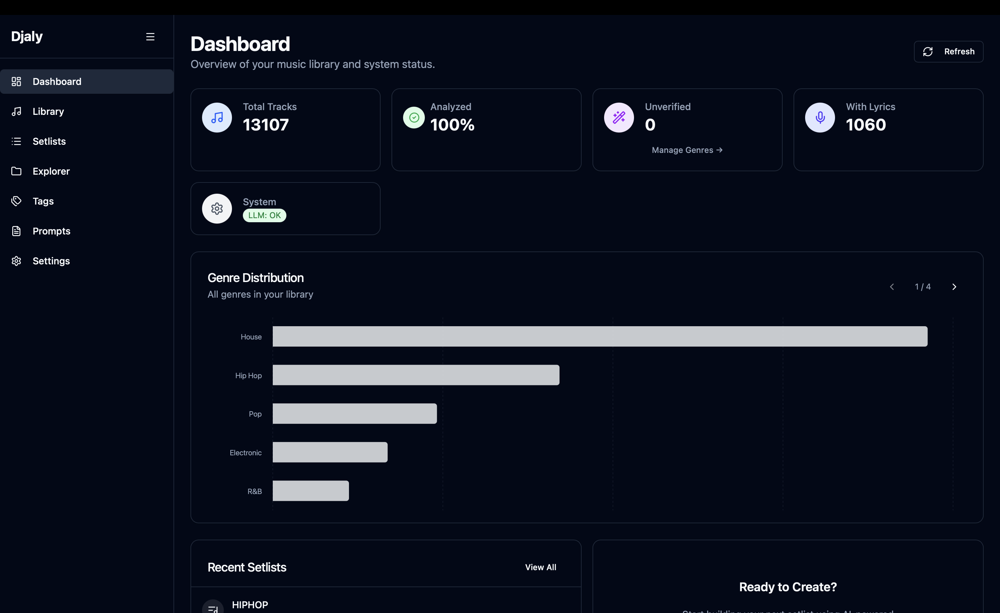
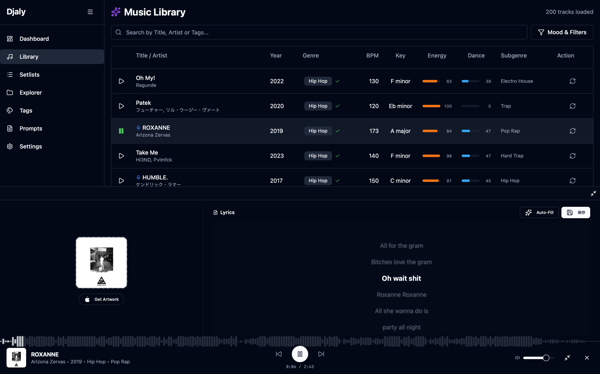

# Djaly

Djalyは、ローカルファーストの音楽ライブラリ管理およびDJツールです。Essentia / MusiCNNによる音響解析と、MCPクライアントと連携した楽曲管理機能を提供します。

## 主な機能

- **高度な楽曲解析**: EssentiaでBPM・Key・Energy等を、MusiCNNで音響特徴をローカル解析します。
- **MCPジャンル分類**: 接続したMCPクライアントのLLMで分類し、構造化結果をDjalyに適用します。
- **自然言語検索**: MCPクライアントが自然言語を特徴量に変換し、Djalyが決定的に検索します。
- **セットリスト作成支援**: 類似楽曲の提案と、MCPから指定された条件によるセットリスト自動生成。
- **Rekordbox連携**: 作成したセットリストをM3U8形式でエクスポート可能。

## インストール方法

### 1. アプリのダウンロード
[Releasesページ](https://github.com/Yutahhhhh/Djaly/releases) から、お使いのOSに合わせたインストーラーをダウンロードしてください。

- **macOS**: `.dmg` ファイル (Apple Silicon用: `aarch64`, Intel用: `x86_64`)
- **Windows**: `.exe` または `.msi` ファイル

### 2. アプリの起動
ダウンロードしたインストーラーを実行し、アプリをインストール・起動してください。

#### ⚠️ macOSをお使いの方へ（重要）
現在、アプリへの署名（Appleによる公証）を行っていないため、インストール後に**「"Djaly"は壊れているため開けません」**というエラーが表示される場合があります。
その場合は、以下の手順で起動してください。

1. アプリを `Applications` （アプリケーション）フォルダに移動します。
2. `ターミナル.app` を開きます（Launchpad > その他 > ターミナル）。
3. 以下のコマンドをコピー＆ペーストして実行（Enterキー）してください。
   ```bash
   xattr -cr /Applications/Djaly.app
   ```
4. 再度アプリをクリックして起動してください。

## 使い方 (User Guide)

### 1. 初期設定 (Settings)

アプリを起動したら、まずは `Settings` 画面で以下の設定を行います。

- **Music Directory**: 楽曲ファイルが保存されているルートディレクトリを指定します。
- **AI Runtime**: Djaly自体にLLMプロバイダーやAPIキーは設定しません。ジャンル分類や自然言語の解釈には、Djaly MCPを接続したクライアントのLLMが使われます。
- **Data Management**:
  - **Library Data**: ライブラリ全体のバックアップや復元（インポート/エクスポート）が可能です。
  - **Metadata**: 楽曲のメタデータのみをJSON形式でエクスポート/インポートできます。

### 2. 楽曲の取り込み (File Explorer)

`File Explorer` 画面から楽曲の解析を開始します。

- 指定したディレクトリ内の楽曲をスキャンし、データベースに取り込みます。
- **解析エンジン**: EssentiaとMusiCNNで音響特徴量を抽出します。この処理にLLMは使いません。
- **バックグラウンド処理**: 数千曲単位の解析もバックグラウンドで実行されます。
- **変更検知**: ファイルパスが変更された場合や新しいファイルが追加された場合、再解析を行うことで検知・更新されます。

### 3. タグ管理 (Tag Manager)
楽曲のメタデータやジャンル情報を包括的に管理します。

#### メタデータ・ジャンル編集


- **Track Info**: リリース年などの基本情報を編集。「Auto-Fill Dates」機能でWebから情報を自動取得・補完可能。
- **Classification (Genre / Subgenre)**:
  - **ジャンル解析**: MCPで楽曲情報を取得し、接続先LLMの判定結果をDjalyに適用。
  - **表記揺れの統一**: "Hip-Hop", "Hip Hop" などの表記揺れを決定的なクリーンアップ機能で統一。
  - **類似楽曲判定**: 解析済みの特徴量から類似楽曲を見つけ、ジャンルを推測・補完。
- **Sync to Files**: データベース上の変更（ジャンル、歌詞、メタデータ）を、実際の楽曲ファイル（ID3タグ等）に一括書き込み。

#### 歌詞管理


- **Lyrics**: 歌詞情報の管理。「Auto-Fill Lyrics」機能での自動取得、手動編集に対応。

### 4. ライブラリ管理 (Music Library)

取り込んだ楽曲は `Music Library` で確認・検索できます。

- **MCP自然言語検索**: MCPクライアントで "Chillな夕暮れ" のような条件をBPMやEnergy等に解釈し、Djalyを検索できます。
- **範囲検索**: BPMやKey、Energyなどの特徴量パラメータを範囲指定して検索可能です。
- **ジャンル検索**: 整理されたジャンルタグでフィルタリングできます。

### 5. セットリスト作成 (Setlist Creator)

DJプレイのためのセットリストを作成します。

- **ライブラリから追加**: 検索結果からドラッグ＆ドロップで追加。
- **類似楽曲提案**: 選択した楽曲に近い曲を音響ベクトル、BPM、Key等から提案します。
- **Auto Generation**: 開始曲と終了曲（オプション）を指定すると、その間を繋ぐセットリストを自動生成します。
- **エクスポート**: 完成したセットリストは **Rekordbox** 等で読み込めるプレイリスト形式（.m3u8）でエクスポート可能です。

### 6. MCP連携
DjalyのMCPサーバーを対応クライアントに接続すると、そのクライアントが選択しているLLMでジャンル判定、自然言語検索、セットリスト条件の解釈、歌詞ワードプレイ選定を行えます。Djalyは必要なコンテキストと決定的な検索・適用ツールだけを提供します。

### 7. ダッシュボード (Dashboard)

現在の楽曲解析状況（進捗率）、ライブラリの統計情報などを確認できます。

### 8. ミュージックプレイヤー (Music Player)


再生中の楽曲のアートワークや歌詞を表示・編集できる高機能プレイヤーです。

- **波形表示 (Waveform)**: 楽曲の波形を可視化し、視覚的に再生位置を確認できます。
- **アートワーク管理**:
  - **Web取得**: 楽曲情報を元にWebからアートワークを検索・取得できます。
- **歌詞管理 (Lyrics)**:
  - **同期歌詞表示**: LRC形式の同期歌詞表示に対応しており、カラオケのように再生に合わせて歌詞が流れます。
  - **編集・保存**: その場で歌詞を修正・保存できます。Webからの歌詞取得もサポートしています。

### 9. アシストモード（macOS）

上部の「解析｜プレイ｜アシスト」から **アシスト** を選ぶと、rekordboxと並べて使う小型画面に切り替わります。

- rekordboxのデッキにロードされた曲を、macOSのアクセシビリティから取得します。初回に案内が出た場合は、システム設定でDjalyのアクセシビリティを許可してください。OCRや画面録画は使いません。
- 基準デッキと「グルーヴ」「展開」「ワードプレイ」を選び、候補をrekordboxのデッキの曲名部分へドラッグします。ドラッグは登録済みの元ファイルのパスを渡します。
- 推薦はDjalyに登録された曲を対象とし、rekordbox未登録・ファイル不在の候補を除外します。ワードプレイは承認済みペアを使用し、承認と試聴確認は区別して表示します。
- デッキへのロードを確認した曲は履歴に保存し、以後の候補から除外します。履歴はアプリを閉じても保持されます。次のセットでは「履歴をリセット」を押してください（現在デッキに載っている曲は引き続き除外されます）。再生済み判定ではなく、アシストが確認したロード履歴です。
- ジャンル条件は「指定なし」「同一ジャンル」「同一サブジャンル」から選べます。Djalyの基準曲の分類に合わせて絞り込み、分類が未設定の場合は条件を勝手に緩めません。
- ピンボタンで最前面表示を切り替えられます。「解析」「プレイ」に戻ると元のサイズへ戻ります。プレイからアシストへ移る際はDjalyの再生エンジンとコントローラー接続を解放します。

MASTER自動追従は未対応です。確認済みの構成はrekordbox 7.2.18の2Deck Horizontalです。別レイアウトや同名ファイルなどで曲を特定できない場合は、未確認として表示します。ブラウザ版ではデッキ取得と外部ドラッグは利用できません。
